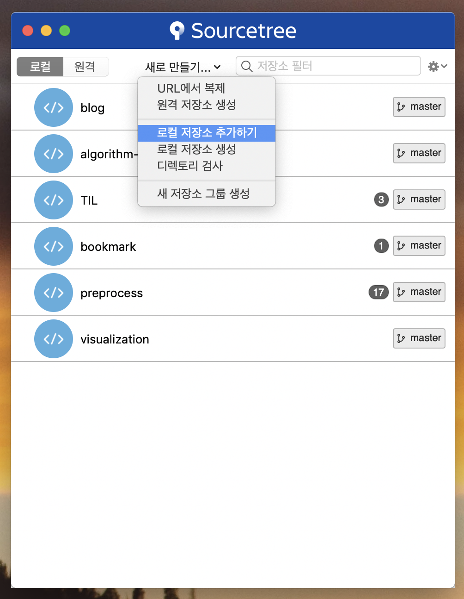
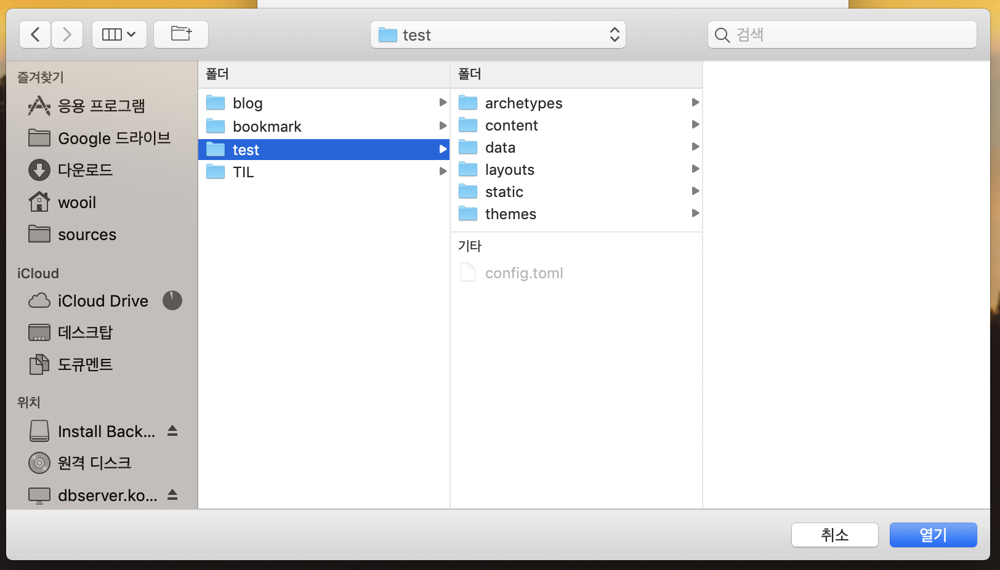
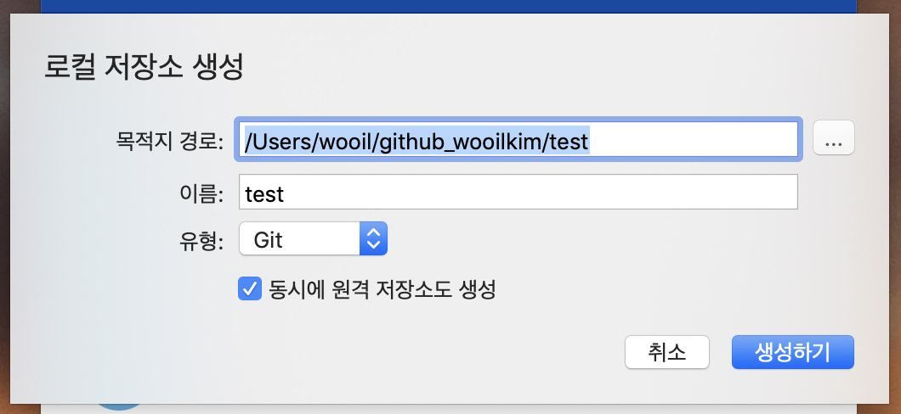
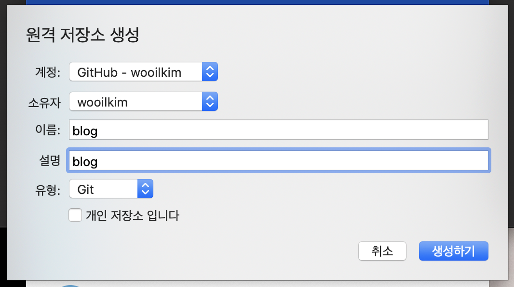
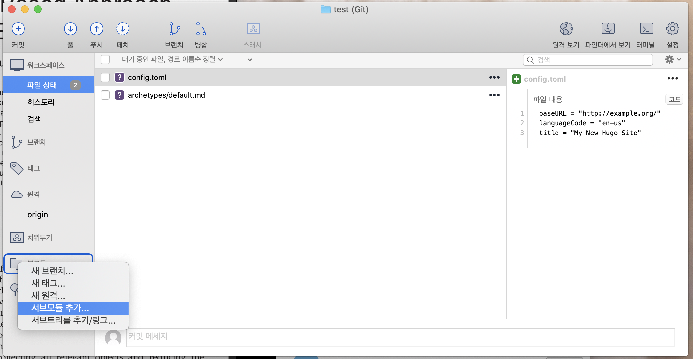
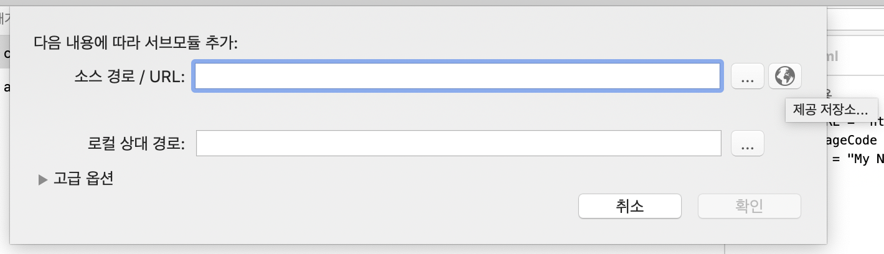
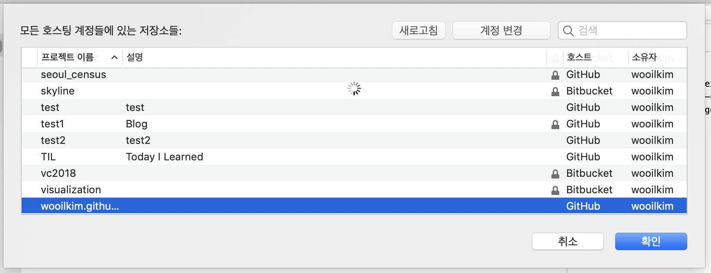
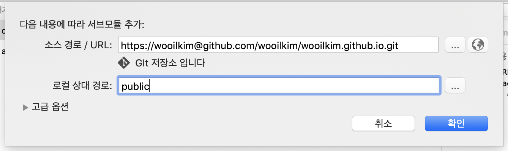
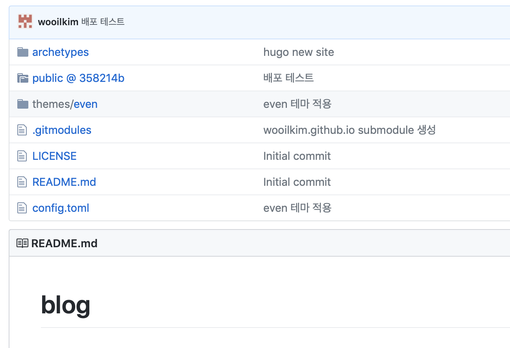

# Hugo + github 블로그 생성

## Repository 생성

### 배포용

"[github 계정이름].github.io"라는 이름을 가진 repository 생성시 [github 계정이름].github.io 라는 주소의 블로그가 생성된다. ex) wooilkim.github.io

### 블로그 구축 파일 관리

블로그 구축 파일을 관리할 repository를 생성. ex) blog

## 프레임워크
Jekyll, Hexo, Hugo 등 여러 가지 프레임워크가 존재 하고, 각각의 장단점이 있다.
hugo 프레임워크를 사용하기로 결정

### hugo 설치
Mac 환경에서 진행하였다.

~~~shell
Brew install hugo
~~~

### hugo 블로그 생성하기

~~~shell
hugo new site [blog 폴더 이름]
ex) hugo new site blog
~~~

### blog Repository 연결하기

git 연결은 Atlassian의 Sourcetree 프로그램을 이용했다.

앞서 hugo 명령어로 생성한 blog 폴더를 로컬 저장소로 추가한다.

미리 추가했기 때문에 test 폴더로 스크린샷을 찍었다.

동시에 원격 저장소도 생성에 체크해 Repository도 생성한다.

github에 연결되어 있다면 새로운 Repository 이름을 지정하면 생성할 수 있다.

이후 배포로 생길 public 폴더를 서브모듈로 github.io Repository에 연결한다.

[계정이름].github.io이름의 Repository를 생성해두어야 한다.

왼쪽 메뉴 중에서 부모듈 메뉴를 우클릭하여 서브모듈 추가..를 선택한다.

이후 뜨는 창에서 지구본모양을 눌러 저장소를 연결한다.

미리 생성해둔 wooilkim.github.io Repository를 선택한다.

- 로컬 상대 경로에 public 을 적어 배포로 생성될 public 폴더를 연결한다.

- 이렇게 하면 blog repository의 public 폴더가 wooilkim.github.io에 연결된다.

blog 폴더에서 hugo 명령어를 입력하면 블로그가 배포된다.

### 테마 설정

[Hugo Themes](https://themes.gohugo.io/) 에서 원하는 테마를 선택한다.
테마 github에 가서 Fork를 하면 내 repositories에 추가된다.

위의 서브모듈 추가 방법과 같은 방법으로 로컬 경로를 "themes/테마이름" 으로 한 뒤 Fork한 repository를 연결하면 된다.

이후 테마 폴더의 examplesites 폴더 안에 있는 config.toml파일을 복사해서 내 블로그 폴더의 config.toml파일을 덮어쓴다.

config.toml파일의 theme="테마이름"에서 테마이름과 "themes/테마이름"은 같아야 한다.

테마를 못찾는다면 아래에 themesdir 항목을 살표 볼 것. themesdir/테마이름 이 테마 폴더를 가리켜야한다.

설정이 완료된 후 터미널에서 블로그 폴더에 들어간 뒤 hugo 명령어를 입력해주고 push하면 적용이 완료된다.

수정한 config.toml 상단 부분은 아래와 같다.

~~~toml
baseurl = "https://wooilkim.github.io/"
languageCode = "en-us"
title = "Wooil"
# Enable comments by entering your Disqus shortname
disqusShortname = "spf13"
# Enable Google Analytics by entering your tracking code
googleAnalytics = ""
# Define the number of posts per page
paginate = 10
footnotereturnlinkcontents = "↩"
theme = "icarus"
# Comment the themesDir option if you use this theme in production
themesDir = "./themes/"

[permalinks]
    post = "/:year/:month/:day/:slug"

[params]
    # Tell me who you are
    author = "Wooil Kim"
    bio = "Blogger - Programmer - Researcher"
    location = "Seoul, Republic of Korea"
    site_description = ""
    copyright  = "Powered by [Hugo](//gohugo.io). Theme by [PPOffice](http://github.com/ppoffice)."
    avatar = "css/images/avatar.png"
    # Enter your email address to display your Gravatar icon in the profile. If not set the theme
    # will fallback to the avatar.
    gravatar = "wooilkim@korea.ac.kr"
    logo = "css/images/logo.png"
    disable_mathjax = false # set to true to disable MathJax
~~~